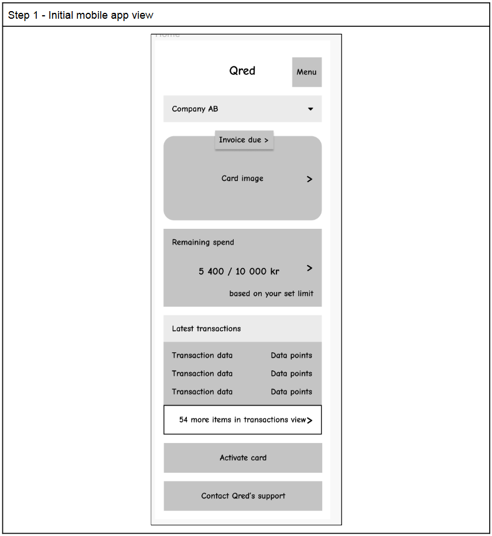

# Case study - Qred

This is a case study for Qred.

Provide an implementation in code to the frontend-view being displayed in Appendix 1.

1. Think about the database schema and the payload response.
2. Think about how you would structure the API to deliver the data required to render the front end in Appendix 1.
3. Implement the API as you see fit
4. Assume you have unlimited budget, complete control of direction and implementation, with backing from senior management.
5. We estimate that you would need about 4-6 hours on this case study, and expect you to prepare notes of the things you would address if you had more time.

## Pre-req's

### ASDF

Have asdf installed and use asdf to install the specified version of NodeJS and yarn specified in the `.tool-versions` file

To install them, simply run `asdf install` and they should be installed.

## Commands

### `yarn dev`

Nodemon watches the changes to the `src` dir and exposes the application to port `4000`.
